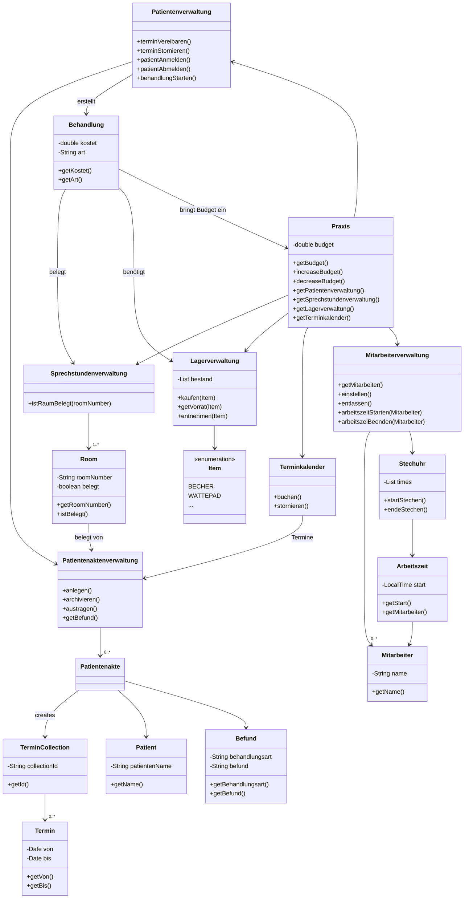

# Softwareprojekt Zahnarztpraxis

# Vorbereitung

## Klassendiagramm

## Komplexer Prozessablauf

Zunächst wird eine Instanz von Praxis erstellt. Mithilfe der Mitarbeiterverwaltung dieser werden nun mehrere Mitarbeiter
“eingestellt”.

Die Mitarbeiter “kommen in der Praxis an”, die Stechuhr wird aktiviert.

Danach werden mithilfe des Terminkalenders Termine für neue Patienten angelegt, wozu gleichzeitig automatisch die
Patientenakten angelegt werden.

Nach Ankunft des Patienten wird eine neue Instanz einer Behandlung angelegt. Ein Raum wird belegt, die benötigten
Materialien werden aus dem Lager entnommen. Dabei wird überprüft, ob Materialien zur Neige gehen und bei Bedarf
automatisch nachgekauft, das Budget sinkt um die Kosten der Materialien.

Nach Beendigung der Behandlung werden Art und Ergebnis als neuer Befund in die Patientenakte übernommen und die Kosten
der Behandlung zum Budget hinzugefügt.

Die Mitarbeiter verlassen nun die Praxis, es wird überprüft, ob sie ihre Arbeitszeit erfüllt haben.